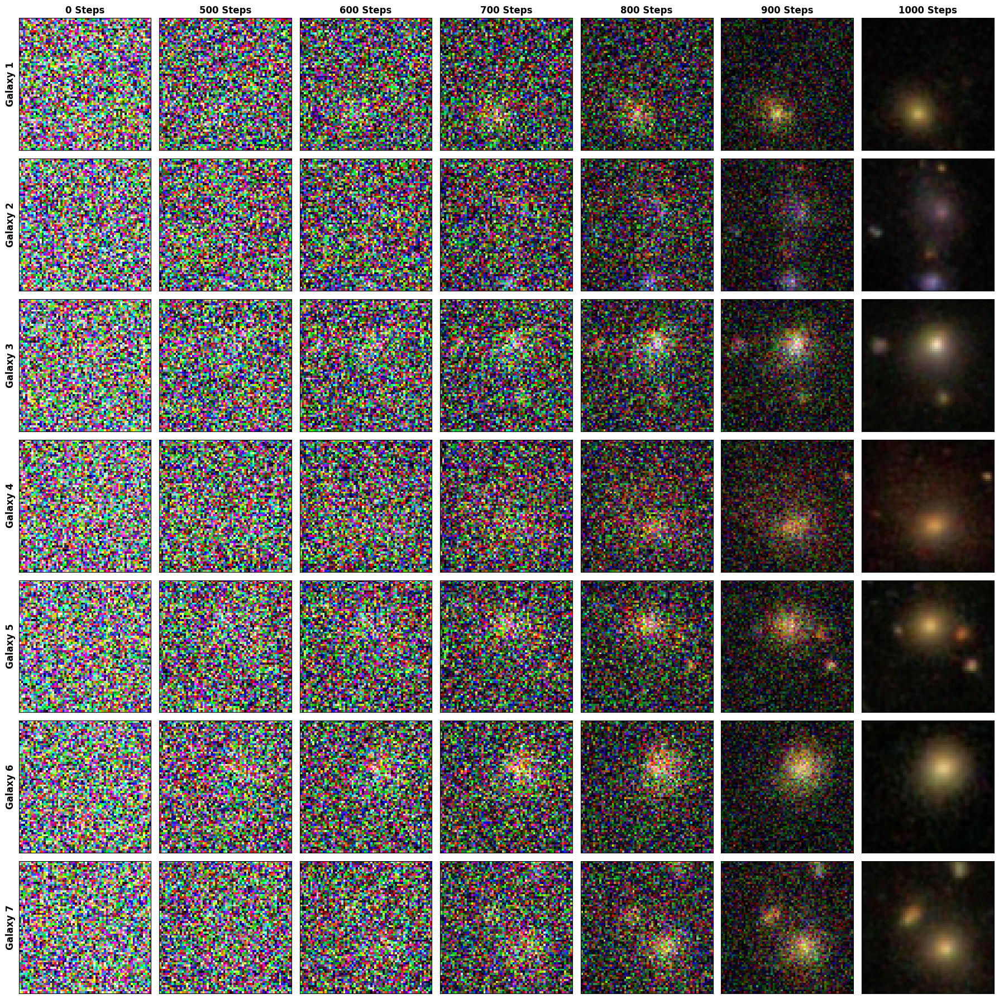

# Galaxy Diffusion Model

This repository contains a diffusion model trained to generate synthetic galaxy images.

## Sampling Evolution

The following image demonstrates the reverse diffusion process, showing the transition from pure noise to structured galaxy formations over various sampling steps.



## Implementation

The model uses a ScoreNet architecture and supports CUDA, MPS, and CPU devices.

```python
device = "cuda" if torch.cuda.is_available() else "mps" if torch.backends.mps.is_available() else "cpu"
vis_diff = VisualDiffusion(device=device)
model = ScoreNet().to(device)

state_dict = torch.load("Results/galaxy_diffusion_model.pth", map_location=device)
model.load_state_dict(state_dict)